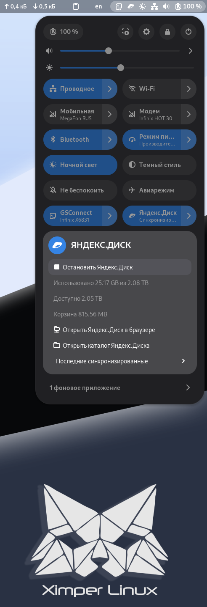

# Yandex.Disk Indicator

**Ya_Disk_Indicator** — это небольшое расширение для GNOME Shell, которое отображает статус синхронизации Yandex.Disk в области уведомлений.

## Описание

Этот индикатор показывает текущее состояние синхронизации Yandex.Disk (например, онлайн/оффлайн, ошибка синхронизации и т.д.). Он позволяет пользователям легко отслеживать работу синхронизации без необходимости открывать полноценное приложение.

## Требования

- GNOME Shell версии 49
- Установленный Yandex.Disk клиент

## Установка

1. Клонируйте репозиторий:
```bash
git clone git@github.com:Link-RUS/Ya_Disk_Indicator.git
```

2. Перейдите в директорию проекта:
```bash
cd Ya_Disk_Indicator
```

3. Выполните скрипты сборки и установки:
```bash
./build.sh
./install.sh
```

4. Перезапустите GNOME Shell (нажмите Alt + F2, введите r и нажмите Enter).

5. Включите расширение через GNOME Tweaks.

## Использование

После включения расширения, иконка Yandex.Disk появится в панели уведомлений GNOME. Щелкните по ней, чтобы получить информацию о текущем состоянии синхронизации.


